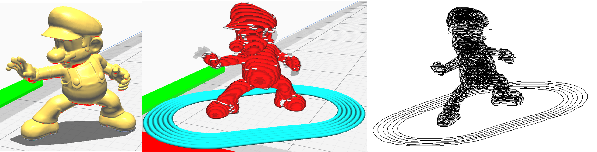

# Simple3DPrinterSimulator
 Load the RepRap G-code and display it in a simple wireframe.

## How to use
If you have a Java execution environment, you can run the test code by simply copying the repository.
Running TestMain3.java will display the wireframe with the specified filename.

---

# 簡易3dプリンタシミュレーター
RepRapで作成されたGコードを読み込み，簡単なワイヤーフレームで表示する．

## 利用方法
Javaの実行環境が整っていれば，リポジトリをコピーするだけでテストコードを実行できます．
TestMain3.javaを実行すると，指定したファイル名のワイヤーフレームを表示します．

---

## Sample model
mario : https://www.myminifactory.com/object/3d-print-mario-37973
boat : https://www.myminifactory.com/object/3d-print-boat-111466

# Execution example
Model (.stl), slice, wireframe (execution result)
